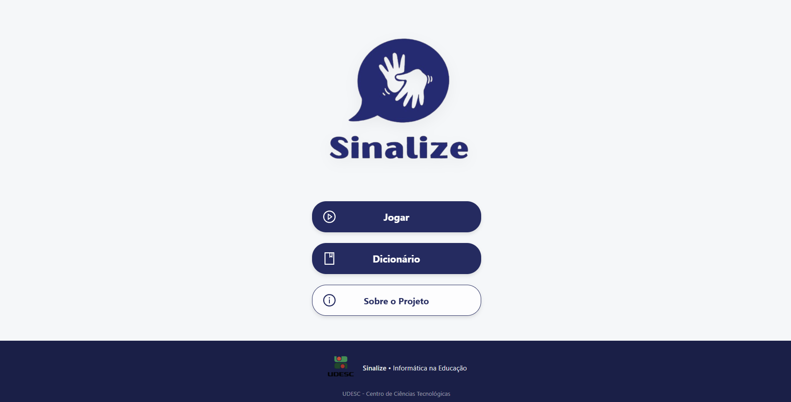
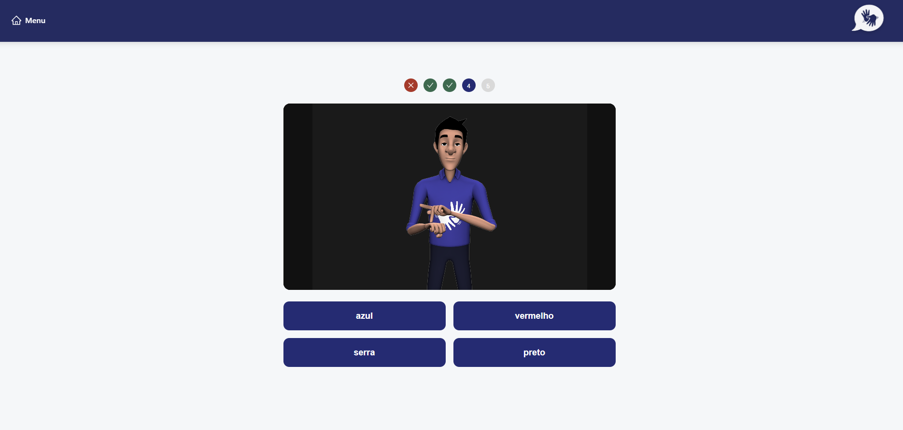
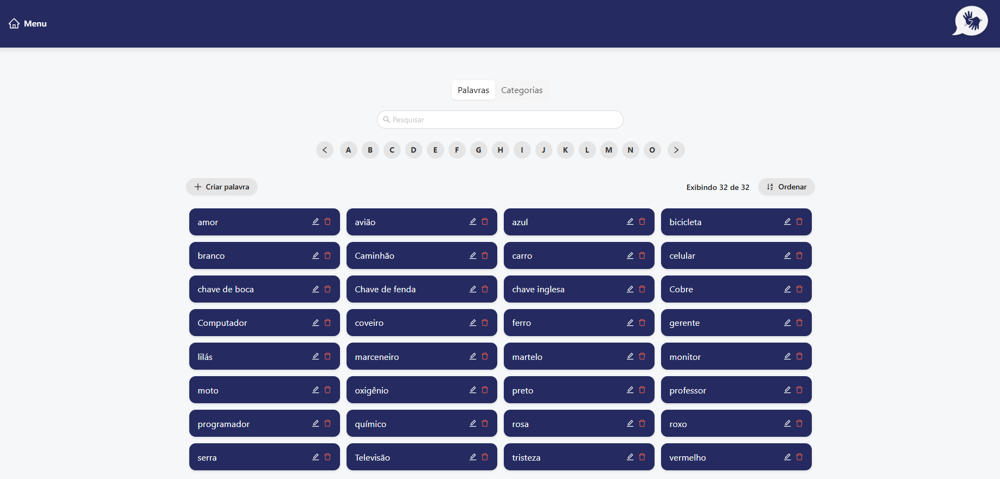

# Sinalize - Front-end

<p align="center">
  
  <a href="https://react.dev/" target="blank"></a>
</p>

O front-end do projeto **Sinalize** é a interface de um quiz interativo e acessível voltado para o aprendizado da Língua Brasileira de Sinais (Libras).

A aplicação é construída com **React** e **TypeScript**, utilizando a biblioteca de componentes **Ant Design** para a interface. A comunicação com o back-end é feita por uma camada de serviços que consome a API REST em **NestJS**, enquanto a sinalização em Libras é renderizada em tempo real através da integração com o widget oficial do **VLibras**.

---

## Autores

João Pedro Ferreira Sell

Pedro Paoli Neto

Felipe Augusto Mais

---

## Tecnologias

- [**React 19**](https://react.dev/)
- [**TypeScript**](https://www.typescriptlang.org/)
- [**React Router**](https://reactrouter.com/)
- [**Ant Design**](https://ant.design/)
- [**VLibras**](https://www.gov.br/governodigital/pt-br/acessibilidade-e-usuario/vlibras)

---

## Funcionalidades

- **Página Inicial (`/`):** Tela de entrada com o acesso ao quiz, ao dicionário e às informações sobre o projeto.
- **Quiz (`/quiz`):** Fluxo de jogo em que o usuário seleciona categorias, assiste ao sinal executado pelo avatar 3D do VLibras e escolhe entre alternativas de palavras.
- **Dicionário (`/dictionary`):** Gerenciamento das **palavras** e **categorias**







---

## Integração com o VLibras

A sinalização é isolada em um `iframe` (`public/vlibras-frame.html`) que carrega o plugin oficial do VLibras. O componente `VLibrasPlayer` se comunica com esse `iframe` via `postMessage`:

- O `iframe` avisa a aplicação quando o avatar 3D está pronto (evento `ready`).
- A aplicação envia a palavra a ser sinalizada (mensagem `sinalizar`), e o avatar a traduz em tempo real.

---

## Como Configurar e Rodar o Projeto

Siga as instruções abaixo para configurar o ambiente de desenvolvimento localmente.

### 1. Pré-requisitos

Antes de começar, certifique-se de ter instalado em sua máquina:

- [Node.js](https://nodejs.org/) (Versão 18 LTS ou superior)
- O **back-end** do Sinalize em execução, pois esta aplicação consome a sua API. Consulte o [repositório back-end](https://github.com/paoli2004/sinalize-back).

### 2. Clonar o Repositório e Instalar Dependências

Abra o seu terminal e execute os comandos:

```bash
# Clonar o repositório front-end e instalar dependências
$ git clone https://github.com/joaosell/sinalize.git
$ cd sinalize
$ npm install
```

### 3. Configurar as Variáveis de Ambiente

Crie um arquivo `.env` na raiz do projeto duplicando o arquivo `.env copy`

### 4. Iniciar a Aplicação

Inicie o servidor de desenvolvimento:

```bash
$ npm run dev
```

A aplicação estará ativa e disponível na porta padrão do Vite: **http://localhost:5173**.

## Repositórios do projeto

Repositório Front-end (React): github.com/joaosell/sinalize

Repositório Back-end (NestJS): github.com/paoli2004/sinalize-back
